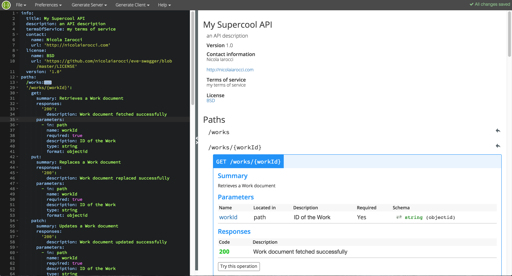

Eve-Swagger |latest-version|
============================

|build-status| |python-support| 

Swagger_ extension for Eve_ powered RESTful APIs.

Usage
-----
.. code-block:: python

    from eve import Eve
    from eve_swagger import swagger, add_documentation

    app = Eve()
    app.register_blueprint(swagger)

    # required. See http://swagger.io/specification/#infoObject for details.
    app.config['SWAGGER_INFO'] = {
        'title': 'My Supercool API',
        'version': '1.0',
        'description': 'an API description',
        'termsOfService': 'my terms of service',
        'contact': {
            'name': 'nicola',
            'url': 'http://nicolaiarocci.com'
        },
        'license': {
            'name': 'BSD',
            'url': 'https://github.com/pyeve/eve-swagger/blob/master/LICENSE',
        },
        schemes: ['http', 'https'],
    }

    # optional. Will use flask.request.host if missing.
    app.config['SWAGGER_HOST'] = 'myhost.com'

    # optional. Add/Update elements in the documentation at run-time without deleting subtrees.
    add_documentation({'paths': {'/status': {'get': {'parameters': [
        {
            'in': 'query',
            'name': 'foobar',
            'required': False,
            'description': 'special query parameter',
            'type': 'string'
        }]
    }}}})

    if __name__ == '__main__':
        app.run()

When the API is up and running, visit the ``/api-docs`` endpoint. The resulting
JSON can then be used with swagger tooling, like the Swagger UI or Swagger Editor:

If you get the error "*Can't read from server. It may not have the appropriate
access-control-origin settings*" from Swagger UI, you might want to enable CORS
support with the ``X_DOMAINS`` and ``X_HEADERS`` configuration in your Eve
``settings.py``:

.. code-block:: python

    X_DOMAINS = ['http://localhost:8000',  # The domain where Swagger UI is running
                 'http://editor.swagger.io',
                 'http://petstore.swagger.io']
    X_HEADERS = ['Content-Type', 'If-Match']  # Needed for the "Try it out" buttons

For more information check the CORS documentation of `Swagger UI`_ and `Swagger
Editor`_.

Installation
------------
.. code-block::

    $ pip install eve-swagger

Description fields on the swagger docs
--------------------------------------

If you would like to include description fields to your swagger docs you can
include a description field in your schema validations in your ``settings.py``.
This can be done per field as well as on the resource-level.

As an example:

.. code-block:: python

    ...
    'description': 'Description of the user resource',
    'schema': {
        'userName': {
            'description': 'The username of the logged in user.',
            'type': 'string',
            'minlength': 1,
            'maxlength': 256,
            'required': True
        },
    }
    ...
    
**NOTE**: If you do use that feature make sure that the ``TRANSPARENT_SCHEMA_RULES``
in your ``settings.py`` is also turned ON, otherwise you will get complains from the
Cerberus library about "unknown field 'description' for field [yourFieldName]"

Disabling the documentation of a resource
-----------------------------------------

You can disable the documentation of a specific resource by adding a ``disable_documentation`` field
to the resource definition in ``settings.py``. This means that the resource will not show up in
the ``paths`` or ``definitions`` sections of the swagger docs.

.. code-block:: python

    ...
    'person': {
        'item_title': 'person',
        'disable_documentation': True,
        'schema': {...}
    }
    ...

Enabling the documentation of Eve event hooks
---------------------------------------------

By setting ``app.config['ENABLE_HOOK_DESCRIPTION']`` to ``True`` you can enable the description of all Eve event hooks.
This is done by showing the docstrings of the callback functions in the swagger docs under the appropriate ``paths``.

.. code-block:: python

    def foo(request, lookup):
        """ Do something before GETting all the people """
        pass
    def bar(response):
        """ Do something when you've fetched the database entries """
        pass
    ...
    app.config['ENABLE_HOOK_DESCRIPTION'] = True
    ...
    app.on_pre_GET_people += foo
    app.on_fetched_resource_people += bar

The swagger docs will now look like this:

.. code-block:: python

    "paths": {
        "/people": {
            "get": {
                ...,
                "description": "**Hooks**:\n* `on_pre_GET_people`:\n\n  * `foo`:\n\n    Do something before GETting all the people\n\n\n* `on_fetched_resource_people`:\n\n  * `bar`:\n\n    Do something when you've fetched the database entries\n\n"
            }
        }
    }

Which will be rendered by Swagger like this:

.. image:: resources/hook_description.png

Copyright
---------
Eve-Swagger is an open source project by `Nicola Iarocci`_.
See the original LICENSE_ for more information.

.. |latest-version| image:: https://img.shields.io/pypi/v/eve-swagger.svg
   :alt: Latest version on PyPI
   :target: https://pypi.python.org/pypi/eve-swagger
.. |build-status| image:: https://travis-ci.org/pyeve/eve-swagger.svg?branch=master
   :alt: Build status
   :target: https://travis-ci.org/pyeve/eve-swagger
.. |python-support| image:: https://img.shields.io/pypi/pyversions/eve-swagger.svg
   :target: https://pypi.python.org/pypi/eve-swagger
   :alt: Python versions
.. |license| image:: https://img.shields.io/pypi/l/eve-swagger.svg
   :alt: Software license
   :target: https://github.com/pyeve/eve-swagger/blob/master/LICENSE

.. _Swagger: http://swagger.io/
.. _Eve: http://python-eve.org/
.. _`popular request`: https://github.com/pyeve/eve/issues/574
.. _LICENSE: https://github.com/pyeve/eve-swagger/blob/master/LICENSE
.. _`Nicola Iarocci`: http://nicolaiarocci.com
.. _`Swagger UI`: https://github.com/swagger-api/swagger-ui#enabling-cors
.. _`Swagger Editor`: https://github.com/swagger-api/swagger-editor/blob/master/docs/cors.md
